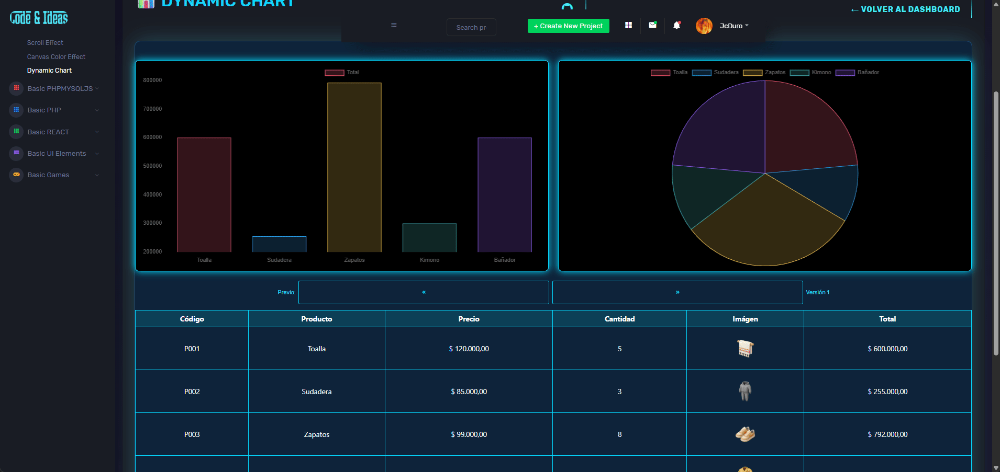

## 📊 Chat estilo Neon 

Dashboard dinámico con gráficas Chart.js + estilo neon + tabla responsive en PHP puro.

---

## 📝 Descripción

es un dashboard minimalista y futurista que convierte datos de inventario en gráficas interactivas de estética neon. Pensado para 
pantallas de venta, backs-oficce o portafolios, muestra productos, precios y existencias con animaciones suaves, 
tooltips con imagen y un versionado dinámico que simula escenarios de venta (hoy, mañana, +10 %, +20 %, etc.). 
Todo funciona con PHP puro, por lo que se instala en cualquier hosting sin dependencias pesadas.

--- 

## 🛠 Características

- Gráficas de barras y pastel 100 % interactivas (Chart.js 4)
- Tooltips personalizados: foto, nombre, código y total al pasar el mouse
- Cinco “versiones” de datos (factores 1.0 → 1.4) navegables con flechas ← →
- Diseño neon variables-CSS: brillo, sombras y colores editables en una línea
- Tabla sincronizada que cambia al mismo tiempo que las gráficas
- Responsive “mobile-first”: tabla se convierte en tarjetas verticales ≤ 600 px
- PHP 8 + PDO: endpoint JSON limpio y seguro contra inyección SQL
- Sin frameworks: copia, ajusta la conexión y listo
- Imágenes WebP optimizadas para carga rápida
- Licencia MIT: úsalo, modifícalo o inclúyelo en tus proyectos sin restricciones

---

## 🖼️ Vista previa

--- 

## 🚀 Demo
[Chart](https://jcduro.bexartideas.com/proyectos/dashjc/chart/chart.php)

---

## 📊 Lenguajes y Herramientas

--- 

--- 
