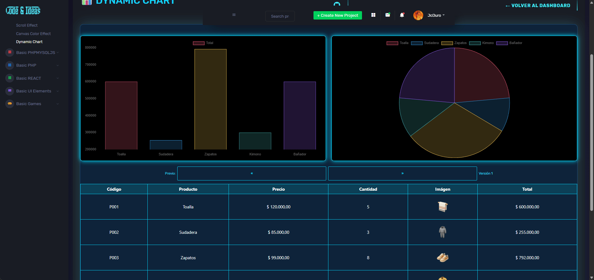

## 📊 Chart estilo Neon 

Dashboard dinámico con gráficas Chart.js + estilo neon + tabla responsive en PHP puro que muestra los primeros 5 Productos.
 ```text
sql
LIMIT 5   // cambialo a tu gusto
 ```

---

## 📝 Descripción

es un dashboard minimalista y futurista que convierte datos de inventario en gráficas interactivas de estética neon. Pensado para 
pantallas de venta, backs-oficce o portafolios, muestra productos, precios y existencias con animaciones suaves, 
tooltips con imagen y un versionado dinámico que simula escenarios de venta (hoy, mañana, +10 %, +20 %, etc.). 
Todo funciona con PHP puro, por lo que se instala en cualquier hosting sin dependencias pesadas.

--- 

## 🛠 Características

- Gráficas de barras y pastel 100 % interactivas (Chart.js 4)
- Tooltips personalizados: foto, nombre, código y total al pasar el mouse
- Cinco “versiones” de datos (factores 1.0 → 1.4) navegables con flechas ← →
- Diseño neon variables-CSS: brillo, sombras y colores editables en una línea
- Tabla sincronizada que cambia al mismo tiempo que las gráficas
- Responsive “mobile-first”: tabla se convierte en tarjetas verticales ≤ 600 px
- PHP 8 + PDO: endpoint JSON limpio y seguro contra inyección SQL
- Sin frameworks: copia, ajusta la conexión y listo
- Imágenes WebP optimizadas para carga rápida
- Licencia MIT: úsalo, modifícalo o inclúyelo en tus proyectos sin restricciones

---

## 🖼️ Vista previa



--- 

## 🚀 Demo
[Chart](https://jcduro.bexartideas.com/proyectos/dashjc/chart/chart.php)

---

## 📊 Lenguajes y Herramientas

[](https://skillicons.dev)


---

🗄️ Base de datos
Nombre BD: colores (ejemplo)

---

 ```text
sql
CREATE TABLE `productos_neon` (
  `id` int(10) UNSIGNED NOT NULL,
  `codigo` varchar(20) NOT NULL,
  `nombre` varchar(100) NOT NULL,
  `precio` decimal(10,2) NOT NULL DEFAULT 0.00,
  `cantidad` int(10) UNSIGNED NOT NULL DEFAULT 1,
  `img` varchar(50) NOT NULL,
  `activo` tinyint(1) NOT NULL DEFAULT 1
) ENGINE=InnoDB DEFAULT CHARSET=utf8mb4 COLLATE=utf8mb4_uca1400_ai_ci;

Ejemplos de registros:

INSERT INTO `productos_neon` (`id`, `codigo`, `nombre`, `precio`, `cantidad`, `img`, `activo`) VALUES
(1, 'P001', 'Toalla', 120000.00, 5, '/img/01.webp', 1),
(2, 'P002', 'Sudadera', 85000.00, 3, '/img/02.webp', 1),
(3, 'P003', 'Zapatos', 99000.00, 8, '/img/03.webp', 1),
(4, 'P004', 'Kimono', 150000.00, 2, '/img/04.webp', 1),
(5, 'P005', 'Bañador', 60000.00, 10, '/img/05.webp', 1),
(6, 'P006', 'Buzo', 70000.00, 4, '/img/06.png', 1),
(7, 'P007', 'Jean', 55000.00, 7, '/img/07.webp', 1),
(8, 'P008', 'Camisetilla', 23000.00, 11, '/img/08.png', 1),
(9, 'P009', 'Guantes', 35000.00, 12, '/img/09.webp', 1),
(10, 'P010', 'Polo', 18000.00, 6, '/img/10.png', 1),
(11, 'P011', 'Gorra', 15000.00, 3, '/img/11.png', 1),
(12, 'P012', 'Camisa', 44000.00, 14, '/img/12.png', 1),
(13, 'P013', 'Blusa', 75000.00, 9, '/img/13.png', 1),
(14, 'P014', 'Camiseta', 29000.00, 8, '/img/14.png', 1),
(15, 'P015', 'Vestido', 93000.00, 5, '/img/15.webp', 1),
(16, 'P016', 'Saco', 100000.00, 4, '/img/16.png', 1),
(17, 'P017', 'Falda', 60000.00, 10, '/img/17.webp', 1),
(18, 'P018', 'Pantalon', 57000.00, 3, '/img/18.webp', 1);

 ```

---

## 🛠️ Stack y tecnologías
Backend: PHP 8.x con PDO (MySQL).
Base de datos: MySQL / MariaDB.
Frontend: HTML5, CSS3 (neon UI), JavaScript ES6.
Canvas: API 2D (drawImage, globalCompositeOperation, fillRect).
Iconos: Font Awesome (para integrar con el dashboard si se desea).
Pagina de imagenes para tu BD en la siguiente Pag:
https://www.thiings.co/things


---

Configurar la conexión a la BD
En db.php:


```php
$DB_HOST = 'localhost';
$DB_NAME = 'colores';
$DB_USER = 'tu_usuario';
$DB_PASS = 'tu_password';
$DB_CHAR = 'utf8mb4';
 ```

Crear la tabla y datos
Ejecuta el script SQL de la sección Base de datos en tu servidor MySQL.
Agregar las imagenes que necesites
Coloca un PNG con fondo transparente, por ejemplo:

```text
text
/img/cami.png
Asegúrate de que la ruta en el JS coincida:
 ```
---

```text
php
chart/
├── chart.php
├── conexion.php               
└── get_productos_neon.php ← Endpoint JSON
├── css/
│   └── chart.css       ← Estilos neon + responsive
├── js/
│   └── Chart.min.js        ← Lógica Chart.js
└── /img/*.webp  ← Imágenes productos
```
---

🔧 Personalización

```text
php
| ¿Qué?            | Archivo                  | Clave                                |
| ---------------- | ------------------------ | ------------------------------------ |
| Colores neon     | `chart.css`              | `:root { --landing-neon: #22d3ee; }` |
| Nº versiones     | `Chart.min.js`           | `const numVersiones = 5;`            |
| Límite productos | `get_productos_neon.php` | `LIMIT 5`                            |
| Breakpoints      | `chart.css`              | `@media (max-width: 600px)`          |

```
---

📱 Responsive
Desktop: gráficas lado a lado + tabla clásica.
Tablet: fuentes más pequeñas, 2→1 columna.
Móvil: tarjetas verticales + scroll suave.


--- 

## 📄 Licencia
Libre, usalo como quieras
<div align="center">
  Hecho con 💙 y neones
</div>

---

## ⭐ Si te gustó este proyecto, no olvides dejar una estrella en GitHub!
